# VoteCounterMachineVision
This is a course project done for Machine Vision and Image processing in University of Moratuwa. When given a image of a election voting paper which is not computer friendly we need to identify the correct vote captured in the voting paper.

## Images
| Sample Image | Automatic Rotation Adjustment | Political Parties |
|----------------|---|---|
|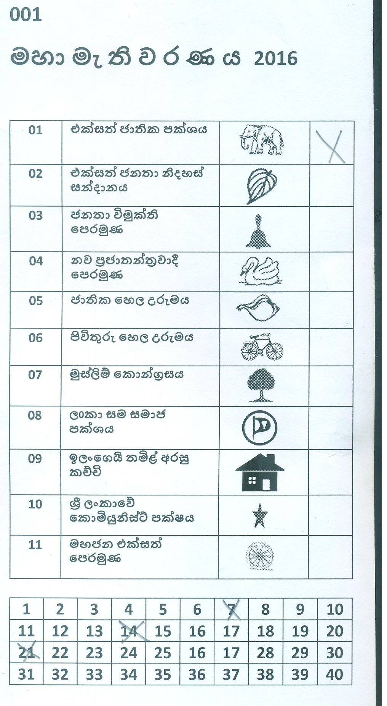|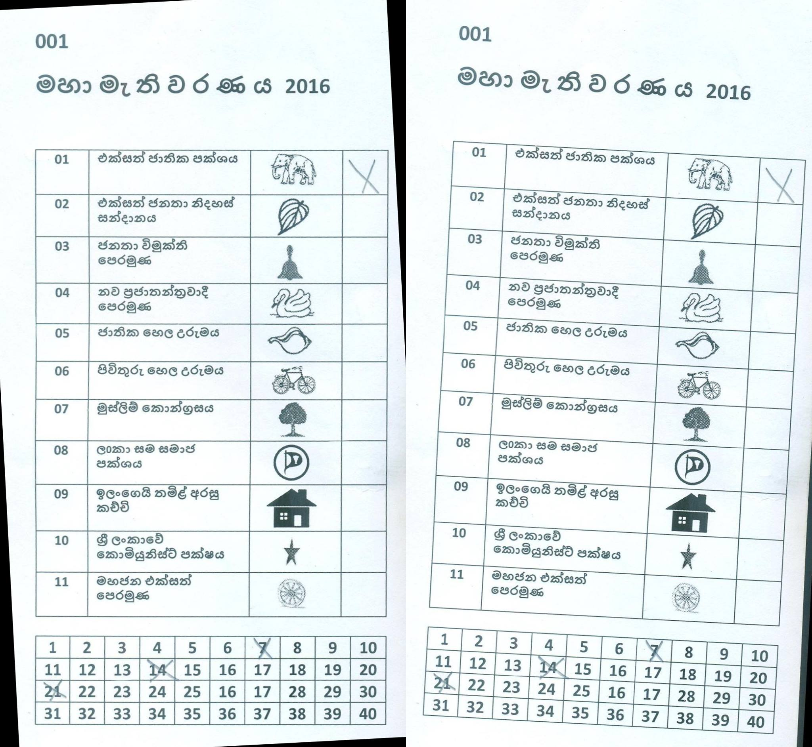| 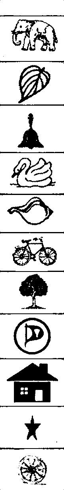|

### Edge detection
| Test 1 | Test 2 | Test 0 |
|----------------|---|---|
|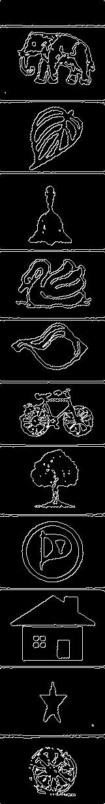|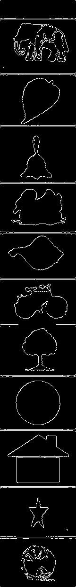| 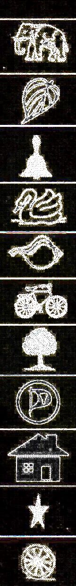|

### Edge detection Before and After Preprocessing
 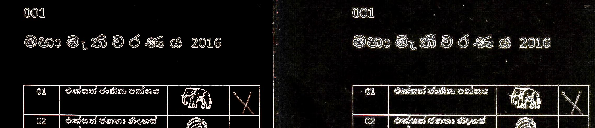

### Preference Counting
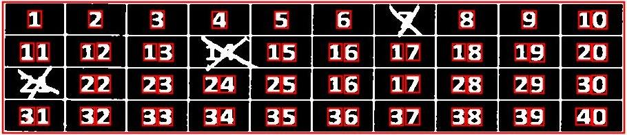
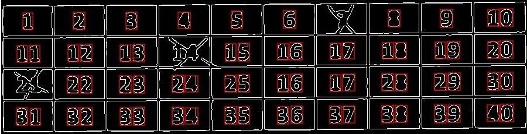

### Thresholding and noise reduction

#### Adaptive Thresholding

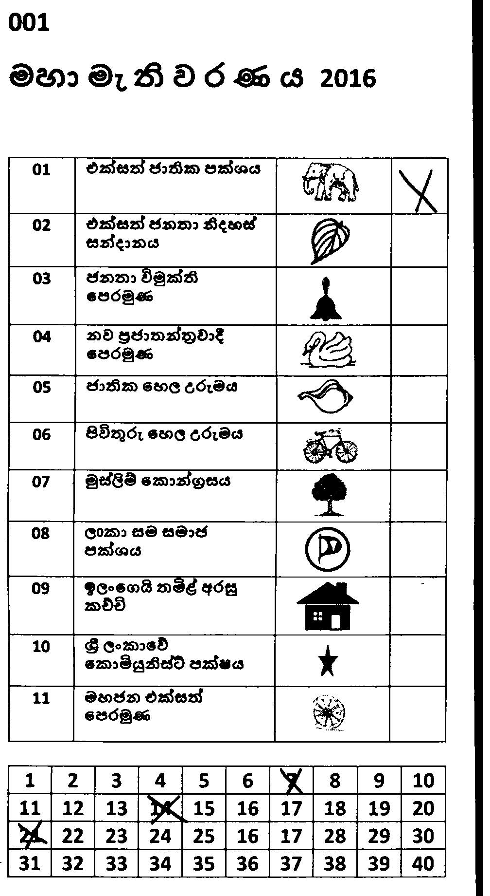

#### Adaptive Thresholding After Noise Reduction

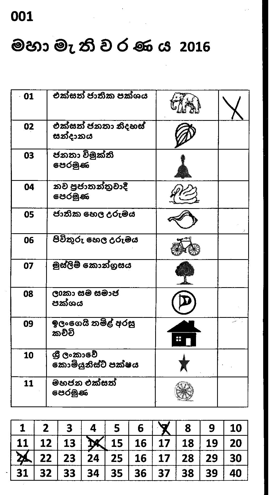

### Feature Detection

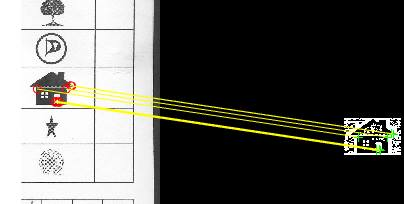

### Segmentation

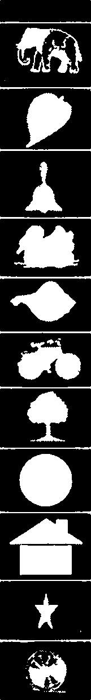
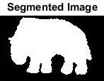

### Histogram

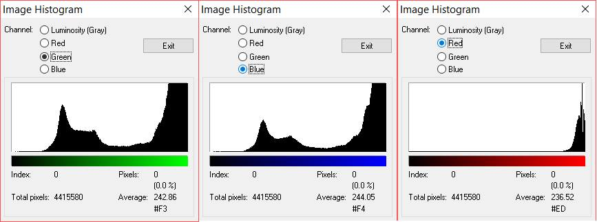